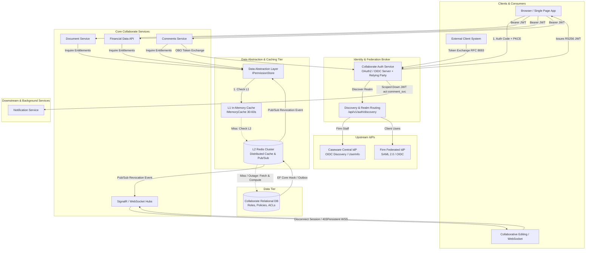
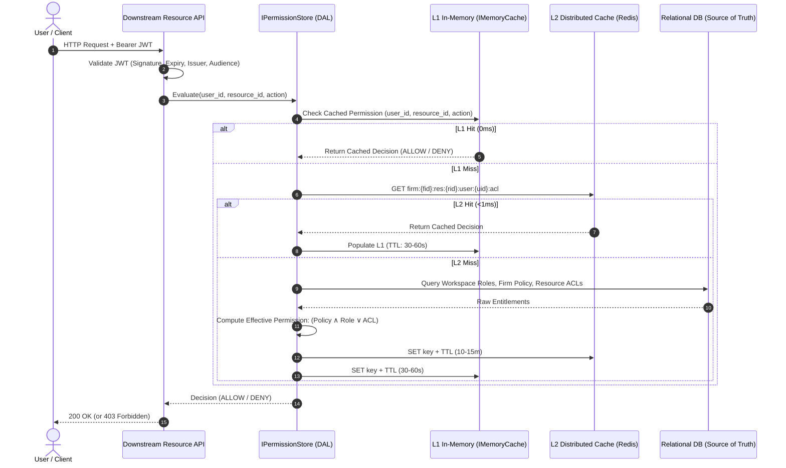
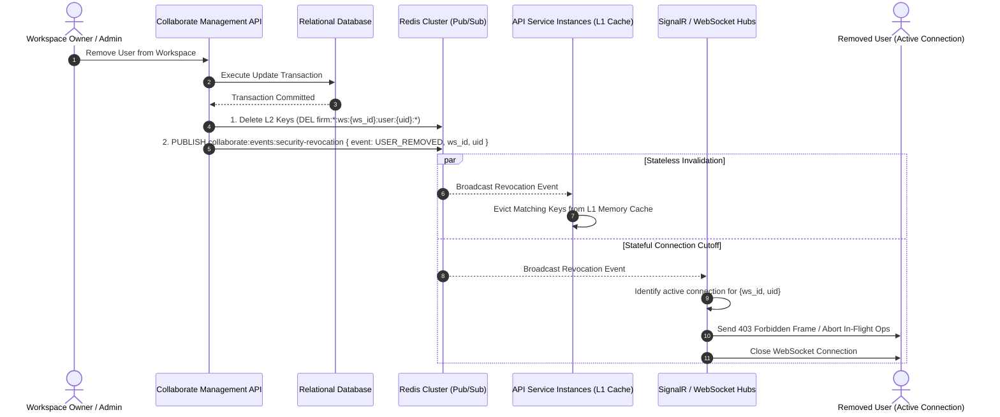
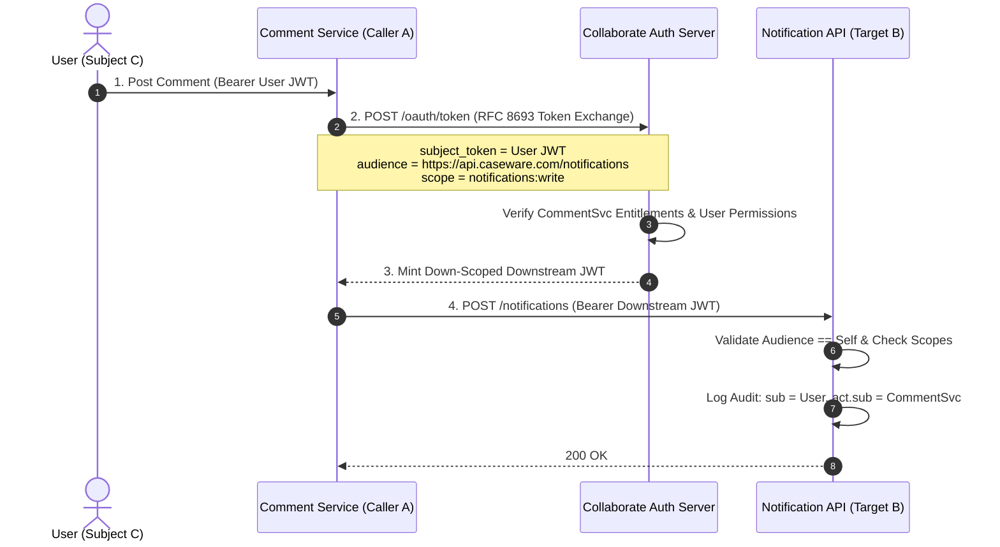
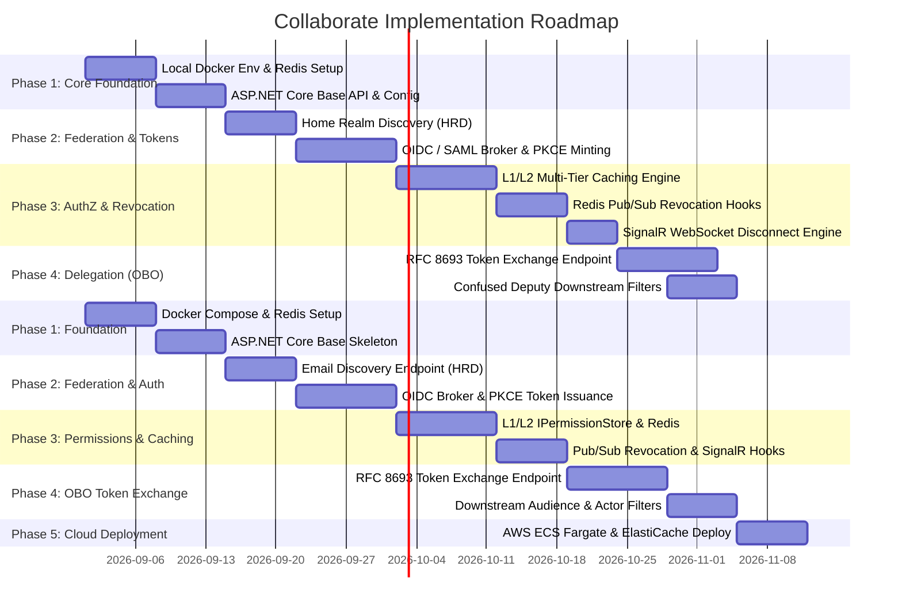
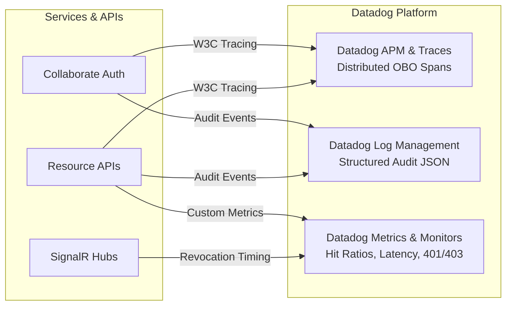
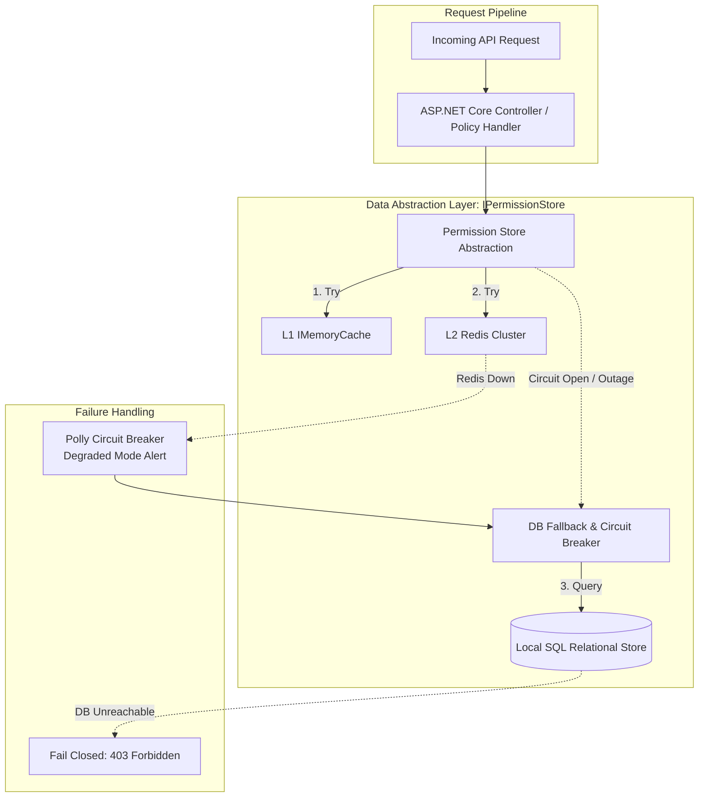

# Part 1: Architecture & Design Specification
# Collaborate Identity & Authorization — Architecture & Design

**System:** Caseware Collaborate Identity & Authorization Platform  
**Target Platform:** ASP.NET Core (.NET 8/9), AWS, Redis Cluster  
**Author / Role:** Senior Developer Candidate  
**Stack Focus:** ASP.NET Core (.NET 8/9), AWS, Redis Cluster, Datadog  

---

## Executive Summary & Core Design Principles
## My Approach & Design Philosophy

Collaborate requires a secure, standards-compliant (OAuth2 / OIDC), high-throughput identity and authorization layer that supports multi-tenant firm federation, fine-grained permission enforcement, real-time revocation, and secure on-behalf-of delegation.
When looking at Collaborate's requirements, we are essentially balancing three competing forces:
1. **Strict Security & Compliance:** We need proper OAuth2/OIDC standards, federation with third-party IdPs, secure token delegation (OBO) without falling into the "confused deputy" trap, and full auditability.
2. **Extreme Performance ($10\text{k}+$ checks/sec):** Microservices like Documents and Comments cannot afford a database query every time a user requests an asset or sends a keystroke.
3. **Sub-Second Revocation:** In an audit/compliance setting, when an external user is kicked out of a workspace, their access must die immediately—including active collaborative editing WebSocket sessions.

The architecture is founded on three core engineering pillars:
1. **Clean Architecture & Strict Decoupling:** Complete separation of concerns between Domain models, Data Abstraction Layers (`IPermissionStore`), Application services, and ASP.NET Core presentation controllers.
2. **Fully Asynchronous Non-Blocking Pipelines:** End-to-end `async`/`await` request execution combined with asynchronous event-driven state invalidation via Redis Pub/Sub to prevent thread pool starvation under high concurrent load ($10\text{k}+$ checks/sec).
3. **Stateless Multi-Instance Images & Horizontal Scalability:** Containerized API services operate 100% statelessly, enabling zero-friction horizontal autoscaling across multi-instance cloud container clusters (e.g., AWS ECS Fargate) without requiring sticky sessions.
To solve this, I designed the system around **Clean Architecture**, **stateless horizontal scalability**, and a **multi-tier caching abstraction (`IPermissionStore`)**. Here is how the pieces fit together.

---

## 1. High-Level Architecture

Here is the high-level topology showing the interaction between the frontend, the Collaborate Auth broker, downstream microservices, the caching tier, and upstream identity providers:



---

### 1.1 Authentication & Identity Federation (Login Flow)
### 1.1 Authentication & Federation Flow (Login)

To accommodate both internal firm employees and external clients with per-firm federation, Collaborate Auth acts as a **Federation Broker (OIDC Relying Party to upstream IdPs, and OAuth 2.0 Authorization Server to Collaborate clients)**.
Instead of forcing downstream services to deal with different identity providers, **Collaborate Auth acts as a Federation Broker**. It is an **OIDC Relying Party (RP)** to upstream IdPs and an **OAuth 2.0 Authorization Server** to internal Collaborate applications.

1. **User Discovery (Home Realm Discovery - HRD):**
   - The frontend presents an email-first login screen.
   - An unauthenticated discovery endpoint (`GET /api/v1/auth/discovery?email={user@domain.com}`) determines tenant routing:
     - **Firm Staff:** Routed to **Caseware Central IdP** (standard OIDC discovery, token, userinfo).
     - **Federated Enterprise Clients:** Routed to the firm's federated **SAML 2.0 / OIDC IdP** configured for that firm context.
     - **Unfederated External Users:** Handled via standard Collaborate invite / local credential flow.
1. **Email-First Discovery (Home Realm Discovery):**
   - The user types their email on the login screen.
   - The frontend calls `GET /api/v1/auth/discovery?email=user@domain.com`.
   - If the email belongs to Caseware staff (`@caseware.com`), we route them to the **Caseware Central IdP**.
   - If the email domain matches a firm with federated SSO configured, we redirect them to that firm's **SAML 2.0 / OIDC IdP**.
   - Otherwise, external invited guests log in with their Collaborate invite/local credentials.

2. **Authorization Code Flow with PKCE:**
   - Client applications initiate standard **OAuth 2.0 Authorization Code Flow + PKCE** (`code_challenge` and `code_challenge_method=S256`) against Collaborate's `/authorize` endpoint.
   - Collaborate preserves client state and PKCE parameters, acting as a gateway and redirecting the browser to the selected upstream IdP.
2. **Authorization Code Flow + PKCE:**
   - The frontend initiates standard **Auth Code + PKCE** against Collaborate Auth (`/authorize` with `code_challenge`).
   - Collaborate Auth preserves the client state and redirects the user's browser to the upstream IdP.

3. **Assertion Ingestion & Token Minting:**
   - The upstream IdP validates credentials/MFA and redirects to Collaborate’s callback handler (`/auth/callback/{provider}`).
   - Collaborate verifies cryptographic signatures, extracts claims (`email`, `upn`, `name_id`), and maps the subject to the internal Collaborate user record and firm membership.
   - Collaborate completes the PKCE exchange and mints a standard **RS256 signed JWT Access Token** containing standardized claims:
     - `sub`: Collaborate internal user ID.
   - The upstream IdP authenticates the user and redirects back to Collaborate (`/auth/callback/...`).
   - Collaborate Auth validates the signature, maps the external claims (`email`, `upn`) to our internal user record and firm membership, and completes the PKCE exchange.
   - We sign and issue our own standard **RS256 JWT Access Token**. This token carries standard, stable claims:
     - `sub`: Internal Collaborate user ID.
     - `tenant_id` / `firm_id`: Active firm context.
     - `user_type`: `firm_staff` or `external_client`.
     - `jti` / `sid`: Unique token and session identifiers for rapid revocation tracking.
     - `user_type`: `firm_staff` vs `external_client`.
     - `jti` / `sid`: Unique token and session IDs for revocation tracking.

---

### 1.2 Fine-Grained Authorization & Multi-Tier Caching (10k+ req/sec)
### 1.2 Fine-Grained Permission Checking & Multi-Tier Caching

Downstream resource APIs (Document Service, Financial Data API, Comments Service) do not communicate directly with the relational database for each authorization check. A multi-tier caching strategy within the Data Abstraction Layer (`IPermissionStore`) guarantees sub-millisecond evaluation at scale.
We need to evaluate complex rules on every request:
$$\text{Access Granted} \iff \text{Firm Policy is OK} \land (\text{Workspace Role} \lor \text{Resource ACL Override})$$

To handle 10,000+ checks/second without killing the SQL database, we use a multi-tier cache managed by our Data Abstraction Layer (`IPermissionStore`):



- **L1 In-Memory Cache (Per-Instance):** Utilizes ASP.NET Core `IMemoryCache` with a 30–60 second sliding TTL. Serves hot-path requests with zero network latency.
- **L2 Distributed Cache (Shared Redis Cluster):** Clustered Redis caching structured permission keys (TTL 10–15 minutes):
  - Workspace Role: `firm:{firm_id}:ws:{workspace_id}:user:{user_id}:role`
  - Resource Overrides: `firm:{firm_id}:res:{resource_id}:user:{user_id}:acl`
- **Evaluation Logic (Hybrid RBAC + ABAC):**
  $$\text{Access Granted} \iff \text{Firm Policy Evaluates TRUE} \land (\text{Workspace Role Entitlement} \lor \text{Resource ACL Override})$$
- **L1 Cache (In-Memory per instance):** Uses ASP.NET Core `IMemoryCache` with a 30–60 second sliding TTL. This gives us pure in-RAM evaluations (0 network hops) for active users.
- **L2 Cache (Distributed Redis Cluster):** Shared across all API replicas (10–15 min TTL) with structured keys like `firm:{firm_id}:ws:{workspace_id}:user:{user_id}:role`.
- **Database (Relational DB):** The source of truth, hit only when both L1 and L2 miss.

---

### 1.3 Real-Time Revocation & Long-Lived Session Cutoff (<1s)
### 1.3 Real-Time Revocation & Active Session Termination (<1s)

When permissions change or users are removed from workspaces, access must be revoked within seconds across both stateless HTTP requests and stateful connections (WebSockets / collaborative editing).
If an external auditor is removed from an engagement workspace, they cannot keep reading documents just because their access token is valid for another 15 minutes. 

Here is how we revoke access in sub-second time:



- **DB Event Hook:** Changes to roles, memberships, or ACLs trigger an event publisher immediately post-commit (via EF Core Interceptors or Transactional Outbox pattern).
- **Pub/Sub Channel:** Published to `collaborate:events:security-revocation`.
- **Immediate Stateless Eviction:** API nodes listening to the channel evict matching local L1 entries. Next HTTP request hits Redis/DB, immediately denying access.
- **Immediate Stateful Disconnect:** SignalR / WebSocket hubs terminate ongoing collaborative editing sessions in real time, aborting uncommitted changes and severing socket connections.
- When the database updates (via EF Core interceptor or Outbox event), it immediately publishes an event to Redis Pub/Sub (`collaborate:events:security-revocation`).
- **For REST API nodes:** Every node receives the message and evicts the relevant keys from its local L1 cache. The user's very next HTTP request will hit Redis/DB and get blocked immediately.
- **For WebSockets / Real-time editing (SignalR):** The SignalR hub receives the revocation event, aborts any pending document edits, sends a `403 Forbidden` disconnect frame, and terminates the socket connection on the spot.

---

### 1.4 On-Behalf-Of (OBO) Delegation & Confused Deputy Prevention
### 1.4 On-Behalf-Of (OBO) Delegation & Avoiding the Confused Deputy

To prevent the **Confused Deputy** problem—where an intermediate service or token is tricked into accessing unauthorized resources—Collaborate implements **OAuth 2.0 Token Exchange (RFC 8693)**.
When a service (like Comments) needs to call another service (like Notifications) on behalf of a user, or when an external firm system calls Collaborate on behalf of an employee, we must prevent the **confused deputy problem**. A service must never be able to reuse a token to perform actions the user never authorized or that the service has no right to touch.

We solve this using standard **OAuth 2.0 Token Exchange (RFC 8693)**:



#### Token Structure & Claim Separation:
- **`sub` (Subject):** Identifies the human user on whose behalf the operation is executed (preserves auditability).
- **`act` (Actor):** Identifies the executing service/system (`act: { "sub": "service_collaborate_comments" }`).
- **`aud` (Audience):** Strictly limited to the target downstream service (e.g., `https://api.caseware.com/notifications`).
- **`scp` / `scope`:** Down-scoped to the minimum necessary operation (`notifications:write`).
#### How the Minted Token Works:
- **`sub` (Subject):** The real human user (e.g. `usr_98765`). Audit logs clearly attribute the action to them.
- **`act` (Actor):** The service doing the calling (`act: { "sub": "service_collaborate_comments" }`).
- **`aud` (Audience):** Locked strictly to the destination service (`https://api.caseware.com/notifications`).
- **`scp` (Scopes):** Narrowed down strictly to what is needed (e.g., `notifications:write`).

#### Downstream Enforcement:
1. **Audience Validation:** ASP.NET Core JWT middleware strictly enforces `ValidateAudience = true`. A token minted for the notification service will be rejected by the financial data service.
#### Downstream Enforcement Rules:
1. **Audience Validation (`ValidateAudience = true`):** If someone tries to send a Notification token to the Financial Data API, ASP.NET Core rejects it immediately.
2. **Effective Scope Intersection:**
   $$\text{Effective Scope} = \text{User Permissions } (C) \cap \text{Caller Delegation Entitlements } (A) \cap \text{Token Scope}$$
3. **Audit Trail Logging:** All services log both `sub` (original author) and `act.sub` (initiating caller) for regulatory compliance and audit attribution.
   $$\text{Effective Scope} = \text{User Permissions} \cap \text{Caller Entitlements} \cap \text{Requested Scope}$$
3. **Audit Trail:** Every service logs both `sub` and `act.sub`, so security investigations know exactly *who* did what *through which service*.

---

## 2. Implementation Plan

The implementation strategy focuses on **cloud-native parity**, rapid developer feedback loops via **Test-Driven Development (TDD)**, and modular rollout phases.
My goal for the implementation is **strict local-to-cloud parity**: everything runs identically in local Docker as it does in AWS.



### 2.1 Local-to-Cloud Environment Parity & Containerization
- **Containerized Architecture:**
  - Standardized `docker-compose.yml` defining the local topology:
    1. `collaborate-api`: ASP.NET Core Web API container with hot reload support.
    2. `collaborate-redis`: Redis 7 Alpine container for distributed caching and Pub/Sub invalidation channels.
    3. `collaborate-db`: Local PostgreSQL/SQL Server for relational schema and role data.
- **12-Factor Environment Configuration:**
  - Dev, Staging, and Production share identical container definitions and runtimes.
  - Runtime behavior is strictly controlled via environment variables:
    - `REDIS__CONNECTION_STRING`: Local `redis:6379` vs. AWS ElastiCache cluster endpoint.
    - `AUTH__ISSUER_URL`, `AUTH__JWKS_ENDPOINT`: Upstream and internal signing endpoints.
    - `CONNECTION_STRINGS__COLLABORATE_DB`: Local connection string vs. AWS RDS Secrets Manager URI.
- **Cloud Deployment Mapping (AWS):**
  - Local containers deploy directly to **AWS ECS (Fargate)** tasks fronted by AWS Application Load Balancers (ALB).
  - Local Redis container maps directly to **AWS ElastiCache for Redis** (Multi-AZ with auto-failover).
### 2.1 Local & Cloud Setup
- **Docker Compose for Local Dev:** Spins up the ASP.NET Core API, Redis Alpine, and a relational DB container.
- **12-Factor Environment Config:** The exact same container image runs in Dev, Staging, and Prod. Behavior is tuned purely through environment variables (`REDIS__CONNECTION_STRING`, `AUTH__ISSUER_URL`, etc.).
- **AWS Target:** In staging/prod, containers run on **AWS ECS Fargate** behind an ALB, and Redis runs on **AWS ElastiCache for Redis** (Multi-AZ).

### 2.2 Phased Rollout & Migration Strategy
1. **Phase 1: Core Foundation & Docker Topology**
   - Establish ASP.NET Core project structure, Redis client (`StackExchange.Redis`), and configuration binding.
2. **Phase 2: Authentication & Federation Gateway**
   - Implement `/api/v1/auth/discovery` for email domain parsing.
   - Implement OIDC broker handlers and PKCE exchange logic.
3. **Phase 3: Fine-Grained Authorization & Rapid Revocation**
   - Implement ASP.NET Core `IAuthorizationHandler` evaluating L1 (`IMemoryCache`) $\rightarrow$ L2 (Redis) $\rightarrow$ DB.
   - Implement Redis Pub/Sub background listener for sub-second cache key eviction and WebSocket/SignalR termination.
4. **Phase 4: Token Exchange / Delegation (Scenario C)**
   - Implement RFC 8693 token exchange endpoint for downstream service-to-service and client-to-service calls.
   - Embed actor claims (`act`) and scope-narrowing validation rules.
5. **Phase 5: Cloud Infrastructure & Staging Verification**
   - Package production Docker images, configure AWS ECS task definitions and Terraform/CloudFormation templates.
### 2.2 Rollout Phases
1. **Phase 1 (Base):** Clean project structure, container setup, configuration binding.
2. **Phase 2 (Login/Federation):** Discovery endpoint, upstream OIDC broker, PKCE exchange, RS256 token issuance.
3. **Phase 3 (AuthZ & Revocation):** Data Abstraction Layer (`IPermissionStore`), L1/L2 caching, Redis Pub/Sub invalidation, SignalR disconnect logic.
4. **Phase 4 (Delegation):** RFC 8693 token exchange endpoint, down-scoping validation, actor claim auditing.
5. **Phase 5 (Cloud Deploy):** Container image build, ECS task definition, Terraform provisioning.

---

## 3. Testing Strategy

A multi-layered test pyramid built on **Test-Driven Development (TDD)** ensures protocol compliance, permission correctness, and high-concurrency resilience.
I believe in **Test-Driven Development (TDD)** and verifying security constraints with realistic integration tests.

```
       / \
      / E2E \       - Full Login, Federation & Collaborative Edit Flows
      / E2E \       - Full login, token exchange, collaborative editing flows
     /-------\
    /  Integ  \     - WebApplicationFactory + Real Redis Container
    /  Integ  \     - WebApplicationFactory + Real Redis (Testcontainers)
   /-----------\
  /    Unit     \   - Policies, Handlers, Claim Extraction & Token Exchange
  /    Unit     \   - Handlers, claims parsing, scope math, token exchange
 /---------------\
```

### 3.1 Unit Testing (Fast Feedback Loop)
- **Authorization Handlers:** Unit test ASP.NET Core `IAuthorizationRequirement` and handlers against mocked `ClaimsPrincipal` contexts.
- **Token Exchange Parser & Validator:** Verify RFC 8693 request parameter parsing (`subject_token`, `audience`, `requested_token_type`).
- **Effective Scope Intersection Engine:** Test mathematical intersection logic:
  $$\text{Effective Scope} = \text{User Permissions} \cap \text{Caller Delegation} \cap \text{Requested Scope}$$
### 3.1 Unit Testing
- Test custom ASP.NET Core `IAuthorizationHandler` rules with mocked `ClaimsPrincipal` objects.
- Unit test the RFC 8693 request parser and scope intersection logic ($\text{Effective Scope} = C \cap A \cap \text{Scope}$).

### 3.2 Integration Testing (`WebApplicationFactory`)
- **Containerized Integration Tests:** Spin up real Redis instances via **Testcontainers for .NET** during test suite runs.
- **Federation & PKCE Verification:** Test complete Authorization Code + PKCE challenge verification using simulated upstream OIDC/SAML IdP endpoints.
- **End-to-End API Pipeline:** Test full middleware pipelines including authentication, custom policy handlers, and response serialization.
- Spin up real Redis containers during tests using **Testcontainers for .NET**.
- Test full HTTP pipelines, middleware authentication, policy enforcement, and JSON serialization.

### 3.3 Scenario C & Confused Deputy Security Tests
- **Audience Mismatch Replay Attacks:** Attempt to present a token minted for `https://api.caseware.com/notifications` to the Financial Data API (`/financial-data`). Assert `401 Unauthorized` / `403 Forbidden` (`ValidateAudience = true`).
- **Privilege Escalation via Delegation:** Attempt to request broader scopes than the original `subject_token` possesses. Assert token exchange rejection (`400 Bad Request: invalid_scope`).
- **Audit Claim Verification:** Assert all minted downstream tokens contain both `sub` (original author) and `act.sub` (calling service), and that downstream controllers record both in audit events.
### 3.3 Security & Confused Deputy Tests (Scenario C)
- **Audience Mismatch Replay:** Try sending a token minted for Notifications to the Financial Data API. Verify it gets rejected (`401`/`403`).
- **Scope Escalation:** Attempt to request broader scopes than the subject token holds. Verify it returns `400 Bad Request (invalid_scope)`.
- **Audit Verification:** Verify downstream controller logs capture both `sub` and `act.sub`.

### 3.4 Rapid Revocation & High-Throughput Load Testing
- **Sub-Second Revocation Benchmark:**
  1. Authenticate user and make requests (populating L1 and L2 caches).
  2. Issue `USER_REMOVED_FROM_WORKSPACE` event via Redis Pub/Sub.
  3. Immediately fire concurrent HTTP requests ($\Delta t < 100\text{ms}$).
  4. Assert all subsequent requests receive `403 Forbidden`.
- **WebSocket / SignalR Active Session Cutoff:**
  1. Open active SignalR connection and begin document editing session.
  2. Trigger user removal.
  3. Assert connection disconnect frame received within $< 1\text{ second}$ and pending document modifications aborted.
- **Throughput & Latency Benchmarks (k6 / NBomber):**
  - Verify sustained 10,000+ checks/second with $p99 < 5\text{ms}$ on L1 cache hits and $p99 < 15\text{ms}$ on L2 Redis cache hits.
### 3.4 Revocation & Load Testing
- **Sub-Second Revocation:** Authenticate a user $\rightarrow$ populate cache $\rightarrow$ fire revocation event via Redis $\rightarrow$ immediately fire HTTP requests $\rightarrow$ verify `403 Forbidden` response in $<100\text{ms}$.
- **WebSocket Disconnect:** Verify SignalR hub drops active editing sessions within 1 second of user removal.
- **Load Test (k6 / NBomber):** Assert 10,000+ checks/sec with $p99 < 5\text{ms}$ on L1 and $p99 < 15\text{ms}$ on L2.

---

## 4. Evaluation & Observability
## 4. Evaluation & Observability (with Datadog)

To guarantee high reliability, sub-second revocation, and seamless regulatory compliance, the platform utilizes **Datadog** for full-stack APM, distributed tracing, metrics, and structured audit logging.
To keep an eye on performance, security anomalies, and compliance in production, we leverage **Datadog**:



### 4.1 Evaluation KPIs & Service Level Objectives (SLOs)
- **Authorization Throughput:** Sustained $\ge 10,000$ authorization checks/second across multi-tenant firms.
- **Latency SLOs:**
  - **L1 In-Memory Hits:** $p95 < 0.5\text{ms}$, $p99 < 1\text{ms}$ (zero network roundtrip).
  - **L2 Redis Cache Hits:** $p95 < 2\text{ms}$, $p99 < 5\text{ms}$.
  - **Relational DB Fallback (Cache Miss):** $p99 < 50\text{ms}$.
- **Revocation Propagation Speed:** $\le 1.0\text{ second}$ end-to-end globally from DB commit to L1 eviction and WebSocket connection cutoff.
- **Cache Efficiency Target:** Combined L1/L2 cache hit ratio $\ge 98\%$ under normal production traffic.
### 4.1 Key Performance Targets (SLOs)
- **Throughput:** Handle $\ge 10,000$ authorization evaluations/sec.
- **Latency:**
  - L1 In-Memory: $< 1\text{ms}$ ($p99$).
  - L2 Redis: $< 5\text{ms}$ ($p99$).
  - DB Fallback: $< 50\text{ms}$ ($p99$).
- **Revocation Propagation:** $< 1.0\text{s}$ globally.
- **Cache Hit Ratio:** $\ge 98\%$ combined L1/L2.

### 4.2 Datadog Observability Integration
- **Distributed APM & Trace Propagation:**
  - OpenTelemetry and W3C `traceparent` headers injected across all downstream service calls.
  - Spans automatically annotated with security metadata:
    - `subject.user_id`: Target employee (`sub`).
    - `actor.service`: Calling service (`act.sub`).
    - `token.audience`: Downstream target audience (`aud`).
    - `tenant.firm_id`: Active tenant identifier.
- **Structured Audit Logging:**
  - Security and authorization decisions emitted in structured JSON format ingested directly by Datadog:
    ```json
    {
      "timestamp": "2026-08-24T21:35:00Z",
      "dd.trace_id": "648392018392",
      "event_type": "AUTHZ_EVALUATION",
      "firm_id": "firm_123",
      "workspace_id": "ws_abc",
      "sub": "usr_98765",
      "act_sub": "service_collaborate_comments",
      "resource_id": "doc_456",
      "action": "documents:read",
      "decision": "ALLOW",
      "cache_tier": "L1_HIT"
    }
    ```
- **Datadog Dashboards & Automated Alerting:**
  - **Cache Degradation Monitor:** Triggers alert if combined L1/L2 hit ratio drops below $95\%$ over a 5-minute window.
  - **Revocation Latency Monitor:** Triggers alert if Pub/Sub propagation exceeds $2.0\text{ seconds}$.
  - **Security Anomaly Monitor:** Triggers alert on anomalous spikes in `401 Unauthorized` or `403 Forbidden` error rates (indicating potential credential stuffing or token reuse).
### 4.2 Datadog APM, Traces & Audit Logs
- **Distributed APM Traces:** Inject W3C `traceparent` headers across microservice hops, tagging spans with `subject.user_id`, `actor.service`, and `token.audience`.
- **Structured JSON Audit Logs:**
  ```json
  {
    "timestamp": "2026-08-24T21:35:00Z",
    "dd.trace_id": "648392018392",
    "event_type": "AUTHZ_EVALUATION",
    "firm_id": "firm_123",
    "workspace_id": "ws_abc",
    "sub": "usr_98765",
    "act_sub": "service_collaborate_comments",
    "resource_id": "doc_456",
    "action": "documents:read",
    "decision": "ALLOW",
    "cache_tier": "L1_HIT"
  }
  ```
- **Monitors & Alerts:** Alert if L1/L2 hit ratio falls below $95\%$, if revocation propagation takes $>2\text{s}$, or if there is a sudden spike in $401/403$ status codes.

---

## 5. Failure Modes & Tradeoffs
## 5. Failure Modes, Resilience & Tradeoffs

Resilience in a high-throughput multi-tenant authorization system demands graceful degradation, strict containment of failure domains, and defensive defaults.



### 5.1 Data Abstraction Layer (`IPermissionStore`) & Backup Strategy
- **Decoupled Architecture:**
  - Controllers and authorization handlers **never access Redis or SQL directly**.
  - All permission inquiries flow through an `IPermissionStore` abstraction.
  - The abstraction orchestrates the resolution pipeline: L1 in-memory $\rightarrow$ L2 Redis $\rightarrow$ SQL database.
- **Redis Outage Resilience (Circuit Breaker & Fallback):**
  - Uses Polly circuit breaker and timeout policies.
  - If Redis times out or the cluster becomes unreachable, the abstraction automatically bypasses Redis and queries the local SQL database directly.
  - Emits a `collaborate.redis.status = DEGRADED` metric to Datadog, triggering an on-call alert while keeping all business operations live.
- **Fail-Closed Security Posture:**
  - If both Redis and the SQL database are simultaneously unreachable, the system strictly **fails closed** (returns `403 Forbidden` / `503 Service Unavailable`). Under no circumstances will the system grant unverified access.
### 5.1 Data Abstraction Layer (`IPermissionStore`) & Redis Outage Plan
- Controllers and policy handlers **never talk directly to Redis or raw SQL**. Everything goes through the `IPermissionStore` interface.
- If Redis fails or has a network partition, the abstraction layer catches the error via a **Polly circuit breaker**, logs an alert to Datadog (`collaborate.redis.status = DEGRADED`), and **automatically falls back to querying the SQL database**.
- **Fail-Closed Security:** If both Redis and the SQL database are down, the system fails closed (returns `403 Forbidden` / `503 Service Unavailable`). It will never grant unauthorized access due to infrastructure failure.

### 5.2 Dropped Event & Invalidation Resilience
- **Network Partition during Revocation:**
  - If a transient network failure causes an API instance to miss a Redis Pub/Sub revocation message, the short L1 cache TTL (30–60 seconds sliding) acts as a strict safety boundary.
  - Maximum window of stale permission state is bounded by the L1 TTL, after which the node refreshes from L2/DB.
- **WebSocket Reconnection Handshake:**
  - Upon network reconnection, SignalR clients must re-authenticate and re-validate active workspace entitlements before rejoining editing channels.
### 5.2 Network Blips & Dropped Invalidation Messages
- If an API instance temporarily loses connection and misses a Redis Pub/Sub revocation message, the short L1 TTL (30–60 seconds sliding) acts as a strict upper bound. The stale window is never longer than 60 seconds.

### 5.3 Architectural Tradeoffs Matrix
### 5.3 Architectural Tradeoffs

| Design Decision | Advantages | Tradeoffs & Mitigations |
| Decision | Why I Chose It | Tradeoff / Mitigation |
| :--- | :--- | :--- |
| **Data Abstraction Layer (`IPermissionStore`)** | Complete separation of concerns; seamless fallback from Redis to SQL DB during outages without controller changes. | Slight interface indirection layer (negligible runtime overhead in .NET). |
| **Multi-Tier Caching (L1 Memory + L2 Redis)** | Enables 10,000+ checks/sec with $p99 < 1\text{ms}$; shields relational database from high load. | Requires cache invalidation orchestration via Redis Pub/Sub on DB changes. |
| **Token Exchange (RFC 8693) for Delegation** | Completely eliminates the "Confused Deputy" problem; ensures strict downstream audience isolation and audit attribution. | Introduces one additional HTTP hop between services during initial downstream token acquisition (mitigated by caching exchanged tokens within their TTL). |
| **Hybrid JWT (Coarse Claims + Dynamic ACLs)** | Tokens remain compact and reusable; avoids massive JWT token bloat from large workspace/document ACL arrays. | Downstream APIs must evaluate dynamic permissions via `IPermissionStore` rather than relying solely on static JWT claims. |
| **Pragmatic Service Layer vs. Full CQRS Framework** | Direct service abstractions (`IPermissionStore`, `ITokenExchangeService`) keep the codebase clean, lean, and easily testable within the 2–3 hour scope. | While full CQRS (via MediatR, command/query dispatchers) is ideal for production scaling of asymmetric read/write paths, adopting it here would introduce accidental framework complexity without adding functional correctness. |
| **Data Abstraction Layer (`IPermissionStore`)** | Complete separation of concerns; seamless fallback from Redis to SQL DB during outages. | Slight interface indirection (negligible overhead in .NET). |
| **Multi-Tier Caching (L1 RAM + L2 Redis)** | 10k+ checks/sec with $p99 < 1\text{ms}$; protects the SQL database from overload. | Requires cache invalidation orchestration via Redis Pub/Sub on DB updates. |
| **Token Exchange (RFC 8693) for Delegation** | Completely solves the Confused Deputy problem; gives strict audience isolation and full audit attribution. | One extra internal HTTP call to exchange tokens (mitigated by caching exchanged tokens within their TTL). |
| **Hybrid JWT (Coarse Claims + Dynamic ACLs)** | Tokens stay compact and reusable; avoids massive JWT bloat with giant permission arrays. | Downstream APIs check dynamic permissions via `IPermissionStore` rather than relying purely on static token claims. |
| **Pragmatic Service Layer vs. Full CQRS** | Clean service interfaces (`IPermissionStore`, `ITokenExchangeService`) keep the code lean, understandable, and testable within the 2–3 hour scope. | Full CQRS (MediatR/command buses) would add framework complexity without functional gain for this exercise. |

### 5.4 Production Evolution: CQRS Consideration
In an enterprise production evolution of Collaborate, **Command Query Responsibility Segregation (CQRS)** represents a natural next step:
- **Write Path (Commands):** Mutating workspace roles, revoking memberships, and sharing document ACLs require strong transactional consistency in the relational SQL database, producing domain events via a Transactional Outbox.
- **Read Path (Queries):** Authorization evaluations (10,000+ checks/sec) read exclusively from denormalized in-memory (L1) and distributed (L2 Redis) cache projections.
- **Targeted Scope Decision:** For this take-home exercise, we preserve this logical separation conceptually within the Data Abstraction Layer while intentionally avoiding full CQRS framework plumbing (e.g., MediatR command buses) to prioritize clarity, testability, and fast iteration without over-engineering.
In a full production environment, separating the high-volume Query path (L1/L2 cache projections at 10,000+ req/sec) from the transactional Command path (role updates + Transactional Outbox events) naturally aligns with **CQRS**. 

For this challenge, I chose to maintain this separation logically within the service layer while intentionally avoiding heavy CQRS framework plumbing to keep the codebase clean, direct, and focused on identity mechanics.

