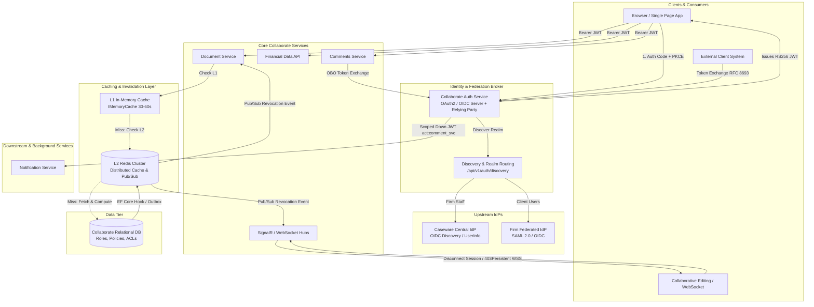
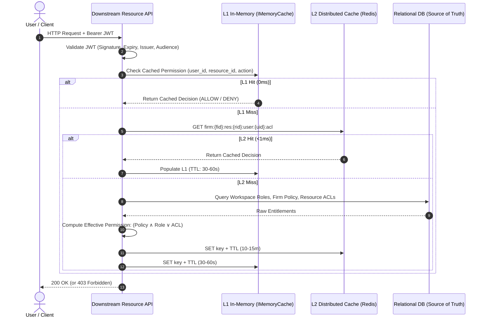
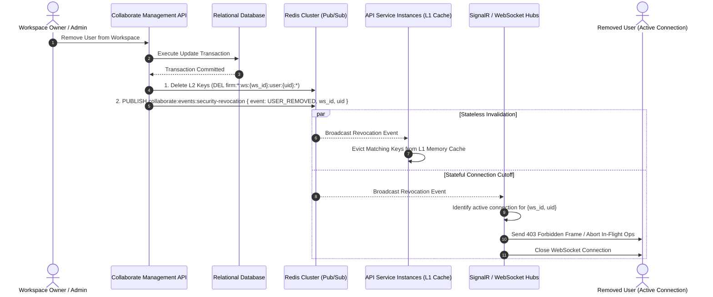
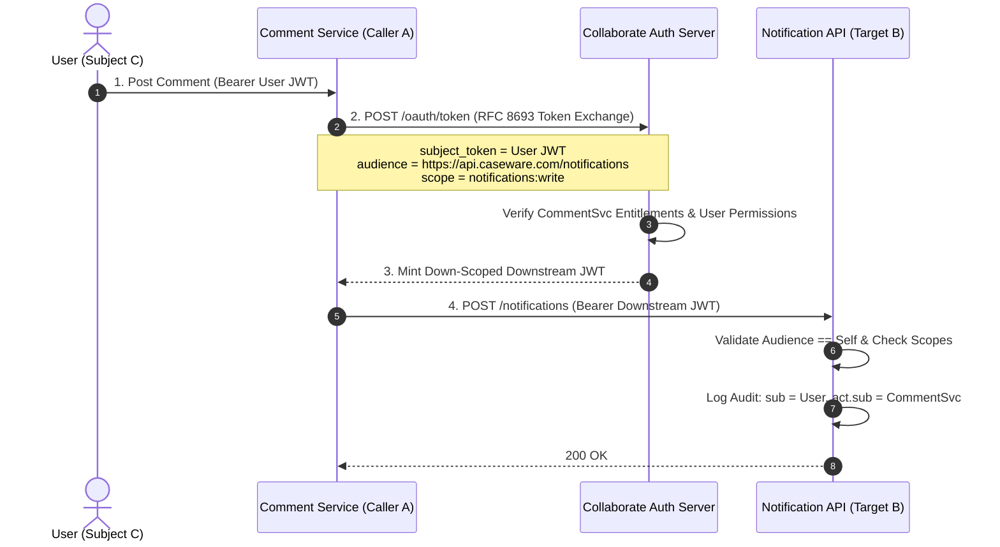
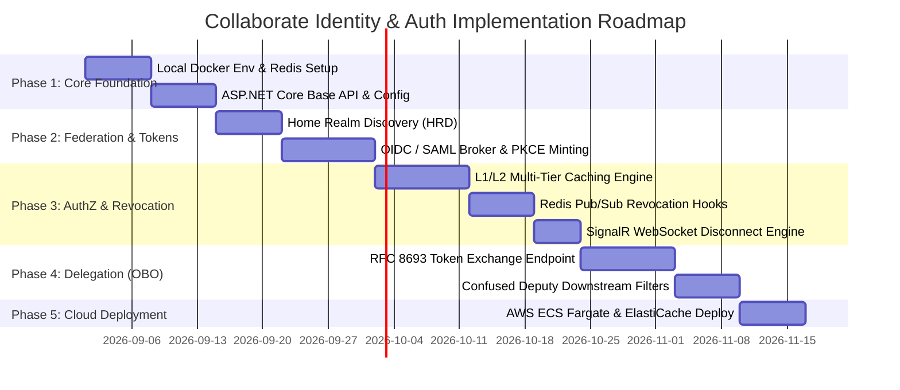

# Part 1: Architecture & Design Specification

**System:** Caseware Collaborate Identity & Authorization Platform  
**Target Platform:** ASP.NET Core (.NET 8/9), AWS, Redis Cluster  

---

## 1. High-Level Architecture

Collaborate requires a robust, standards-compliant (OAuth2 / OIDC), high-throughput identity and authorization layer that supports multi-tenant firm federation, fine-grained permission enforcement, real-time revocation, and secure on-behalf-of delegation.



---

### 1.1 Authentication & Identity Federation (Login Flow)

To accommodate both internal firm employees and external clients with per-firm federation, Collaborate Auth acts as a **Federation Broker (OIDC Relying Party to upstream IdPs, and OAuth 2.0 Authorization Server to Collaborate clients)**.

1. **User Discovery (Home Realm Discovery - HRD):**
   - The frontend presents an email-first login screen.
   - An unauthenticated discovery endpoint (`GET /api/v1/auth/discovery?email={user@domain.com}`) determines tenant routing:
     - **Firm Staff:** Routed to **Caseware Central IdP** (standard OIDC discovery, token, userinfo).
     - **Federated Enterprise Clients:** Routed to the firm's federated **SAML 2.0 / OIDC IdP** configured for that firm context.
     - **Unfederated External Users:** Handled via standard Collaborate invite / local credential flow.

2. **Authorization Code Flow with PKCE:**
   - Client applications initiate standard **OAuth 2.0 Authorization Code Flow + PKCE** (`code_challenge` and `code_challenge_method=S256`) against Collaborate's `/authorize` endpoint.
   - Collaborate preserves client state and PKCE parameters, acting as a gateway and redirecting the browser to the selected upstream IdP.

3. **Assertion Ingestion & Token Minting:**
   - The upstream IdP validates credentials/MFA and redirects to Collaborate’s callback handler (`/auth/callback/{provider}`).
   - Collaborate verifies cryptographic signatures, extracts claims (`email`, `upn`, `name_id`), and maps the subject to the internal Collaborate user record and firm membership.
   - Collaborate completes the PKCE exchange and mints a standard **RS256 signed JWT Access Token** containing standardized claims:
     - `sub`: Collaborate internal user ID.
     - `tenant_id` / `firm_id`: Active firm context.
     - `user_type`: `firm_staff` or `external_client`.
     - `jti` / `sid`: Unique token and session identifiers for rapid revocation tracking.

---

### 1.2 Fine-Grained Authorization & Multi-Tier Caching (10k+ req/sec)

Downstream resource APIs (Document Service, Financial Data API, Comments Service) do not communicate directly with the relational database for each authorization check. A multi-tier caching strategy guarantees sub-millisecond evaluation at scale.



- **L1 In-Memory Cache (Per-Instance):** Utilizes ASP.NET Core `IMemoryCache` with a 30–60 second sliding TTL. Serves hot-path requests with zero network latency.
- **L2 Distributed Cache (Shared Redis Cluster):** Clustered Redis caching structured permission keys (TTL 10–15 minutes):
  - Workspace Role: `firm:{firm_id}:ws:{workspace_id}:user:{user_id}:role`
  - Resource Overrides: `firm:{firm_id}:res:{resource_id}:user:{user_id}:acl`
- **Evaluation Logic (Hybrid RBAC + ABAC):**
  $$\text{Access Granted} \iff \text{Firm Policy Evaluates TRUE} \land (\text{Workspace Role Entitlement} \lor \text{Resource ACL Override})$$

---

### 1.3 Real-Time Revocation & Long-Lived Session Cutoff (<1s)

When permissions change or users are removed from workspaces, access must be revoked within seconds across both stateless HTTP requests and stateful connections (WebSockets / collaborative editing).



- **DB Event Hook:** Changes to roles, memberships, or ACLs trigger an event publisher immediately post-commit (via EF Core Interceptors or Transactional Outbox pattern).
- **Pub/Sub Channel:** Published to `collaborate:events:security-revocation`.
- **Immediate Stateless Eviction:** API nodes listening to the channel evict matching local L1 entries. Next HTTP request hits Redis/DB, immediately denying access.
- **Immediate Stateful Disconnect:** SignalR / WebSocket hubs terminate ongoing collaborative editing sessions in real time, aborting uncommitted changes and severing socket connections.

---

### 1.4 On-Behalf-Of (OBO) Delegation & Confused Deputy Prevention

To prevent the **Confused Deputy** problem—where an intermediate service or token is tricked into accessing unauthorized resources—Collaborate implements **OAuth 2.0 Token Exchange (RFC 8693)**.



#### Token Structure & Claim Separation:
- **`sub` (Subject):** Identifies the human user on whose behalf the operation is executed (preserves auditability).
- **`act` (Actor):** Identifies the executing service/system (`act: { "sub": "service_collaborate_comments" }`).
- **`aud` (Audience):** Strictly limited to the target downstream service (e.g., `https://api.caseware.com/notifications`).
- **`scp` / `scope`:** Down-scoped to the minimum necessary operation (`notifications:write`).

#### Downstream Enforcement:
1. **Audience Validation:** ASP.NET Core JWT middleware strictly enforces `ValidateAudience = true`. A token minted for the notification service will be rejected by the financial data service.
2. **Effective Scope Intersection:**
   $$\text{Effective Scope} = \text{User Permissions } (C) \cap \text{Caller Delegation Entitlements } (A) \cap \text{Token Scope}$$
3. **Audit Trail Logging:** All services log both `sub` (original author) and `act.sub` (initiating caller) for regulatory compliance and audit attribution.

---

## 2. Implementation Plan

The implementation strategy focuses on **cloud-native parity**, rapid developer feedback loops via **Test-Driven Development (TDD)**, and modular rollout phases.



### 2.1 Local-to-Cloud Environment Parity & Containerization
- **Containerized Architecture:**
  - Standardized `docker-compose.yml` defining the local topology:
    1. `collaborate-api`: ASP.NET Core Web API container with hot reload support.
    2. `collaborate-redis`: Redis 7 Alpine container for distributed caching and Pub/Sub invalidation channels.
    3. `collaborate-db`: Local PostgreSQL/SQL Server for relational schema and role data.
- **12-Factor Environment Configuration:**
  - Dev, Staging, and Production share identical container definitions and runtimes.
  - Runtime behavior is strictly controlled via environment variables:
    - `REDIS__CONNECTION_STRING`: Local `redis:6379` vs. AWS ElastiCache cluster endpoint.
    - `AUTH__ISSUER_URL`, `AUTH__JWKS_ENDPOINT`: Upstream and internal signing endpoints.
    - `CONNECTION_STRINGS__COLLABORATE_DB`: Local connection string vs. AWS RDS Secrets Manager URI.
- **Cloud Deployment Mapping (AWS):**
  - Local containers deploy directly to **AWS ECS (Fargate)** tasks fronted by AWS Application Load Balancers (ALB).
  - Local Redis container maps directly to **AWS ElastiCache for Redis** (Multi-AZ with auto-failover).

### 2.2 Phased Rollout & Migration Strategy
1. **Phase 1: Core Foundation & Docker Topology**
   - Establish ASP.NET Core project structure, Redis client (`StackExchange.Redis`), and configuration binding.
2. **Phase 2: Authentication & Federation Gateway**
   - Implement `/api/v1/auth/discovery` for email domain parsing.
   - Implement OIDC broker handlers and PKCE exchange logic.
3. **Phase 3: Fine-Grained Authorization & Rapid Revocation**
   - Implement ASP.NET Core `IAuthorizationHandler` evaluating L1 (`IMemoryCache`) $\rightarrow$ L2 (Redis) $\rightarrow$ DB.
   - Implement Redis Pub/Sub background listener for sub-second cache key eviction and WebSocket/SignalR termination.
4. **Phase 4: Token Exchange / Delegation (Scenario C)**
   - Implement RFC 8693 token exchange endpoint for downstream service-to-service and client-to-service calls.
   - Embed actor claims (`act`) and scope-narrowing validation rules.
5. **Phase 5: Cloud Infrastructure & Staging Verification**
   - Package production Docker images, configure AWS ECS task definitions and Terraform/CloudFormation templates.

---

## 3. Testing Strategy

A multi-layered test pyramid built on **Test-Driven Development (TDD)** ensures protocol compliance, permission correctness, and high-concurrency resilience.

```
       / \
      / E2E \       - Full Login, Federation & Collaborative Edit Flows
     /-------\
    /  Integ  \     - WebApplicationFactory + Real Redis Container
   /-----------\
  /    Unit     \   - Policies, Handlers, Claim Extraction & Token Exchange
 /---------------\
```

### 3.1 Unit Testing (Fast Feedback Loop)
- **Authorization Handlers:** Unit test ASP.NET Core `IAuthorizationRequirement` and handlers against mocked `ClaimsPrincipal` contexts.
- **Token Exchange Parser & Validator:** Verify RFC 8693 request parameter parsing (`subject_token`, `audience`, `requested_token_type`).
- **Effective Scope Intersection Engine:** Test mathematical intersection logic:
  $$\text{Effective Scope} = \text{User Permissions} \cap \text{Caller Delegation} \cap \text{Requested Scope}$$

### 3.2 Integration Testing (`WebApplicationFactory`)
- **Containerized Integration Tests:** Spin up real Redis instances via **Testcontainers for .NET** during test suite runs.
- **Federation & PKCE Verification:** Test complete Authorization Code + PKCE challenge verification using simulated upstream OIDC/SAML IdP endpoints.
- **End-to-End API Pipeline:** Test full middleware pipelines including authentication, custom policy handlers, and response serialization.

### 3.3 Scenario C & Confused Deputy Security Tests
- **Audience Mismatch Replay Attacks:** Attempt to present a token minted for `https://api.caseware.com/notifications` to the Financial Data API (`/financial-data`). Assert `401 Unauthorized` / `403 Forbidden` (`ValidateAudience = true`).
- **Privilege Escalation via Delegation:** Attempt to request broader scopes than the original `subject_token` possesses. Assert token exchange rejection (`400 Bad Request: invalid_scope`).
- **Audit Claim Verification:** Assert all minted downstream tokens contain both `sub` (original author) and `act.sub` (calling service), and that downstream controllers record both in audit events.

### 3.4 Rapid Revocation & High-Throughput Load Testing
- **Sub-Second Revocation Benchmark:**
  1. Authenticate user and make requests (populating L1 and L2 caches).
  2. Issue `USER_REMOVED_FROM_WORKSPACE` event via Redis Pub/Sub.
  3. Immediately fire concurrent HTTP requests ($\Delta t < 100\text{ms}$).
  4. Assert all subsequent requests receive `403 Forbidden`.
- **WebSocket / SignalR Active Session Cutoff:**
  1. Open active SignalR connection and begin document editing session.
  2. Trigger user removal.
  3. Assert connection disconnect frame received within $< 1\text{ second}$ and pending document modifications aborted.
- **Throughput & Latency Benchmarks (k6 / NBomber):**
  - Verify sustained 10,000+ checks/second with $p99 < 5\text{ms}$ on L1 cache hits and $p99 < 15\text{ms}$ on L2 Redis cache hits.

---

## 4. Evaluation & Observability

*(To be detailed in next step)*

---

## 5. Failure Modes & Tradeoffs

*(To be detailed in next step)*


