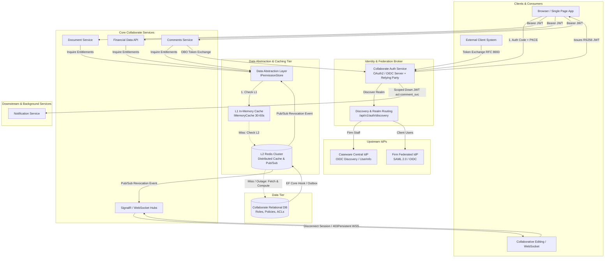
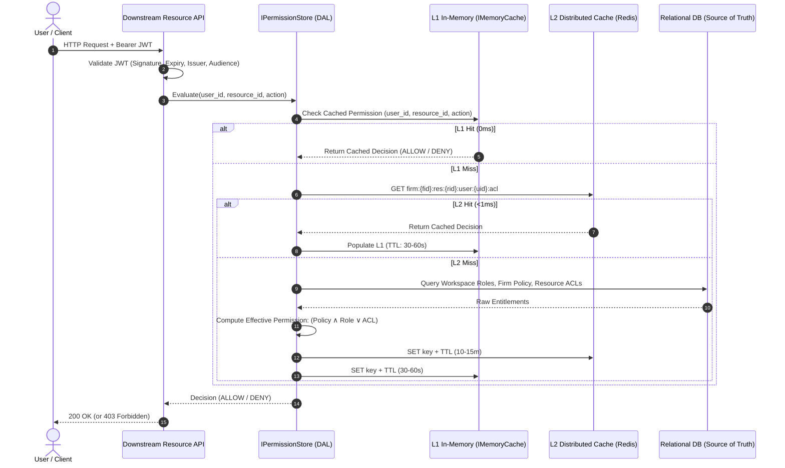
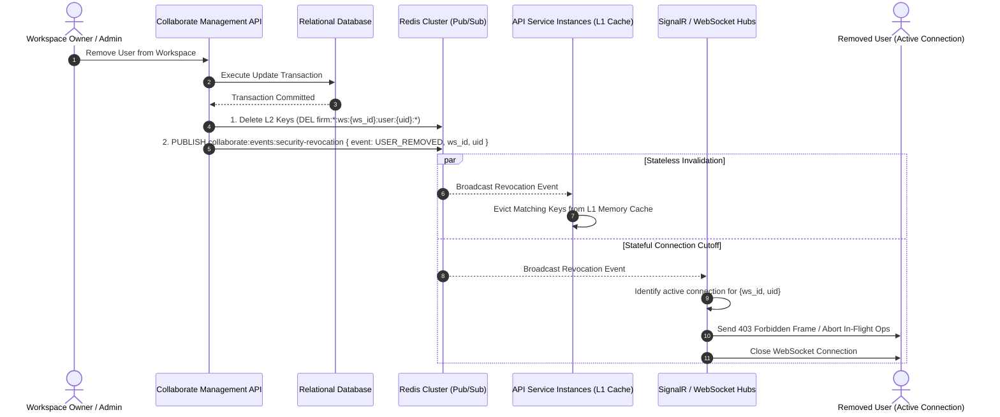
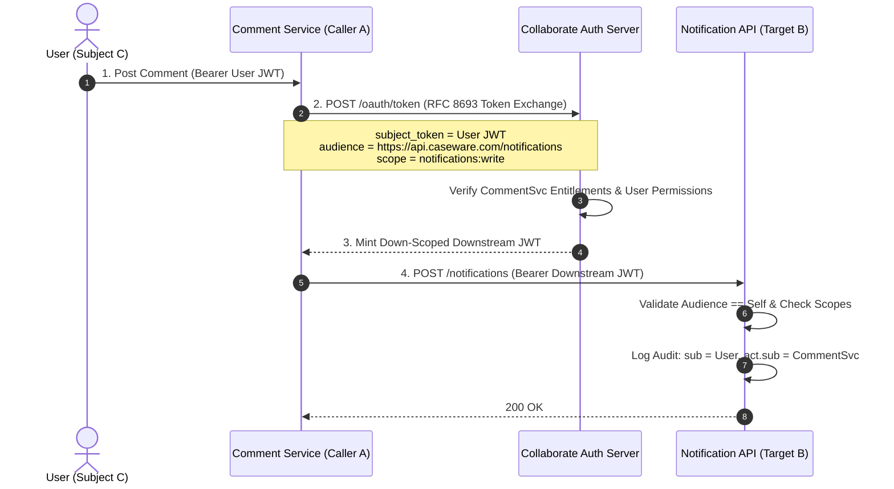
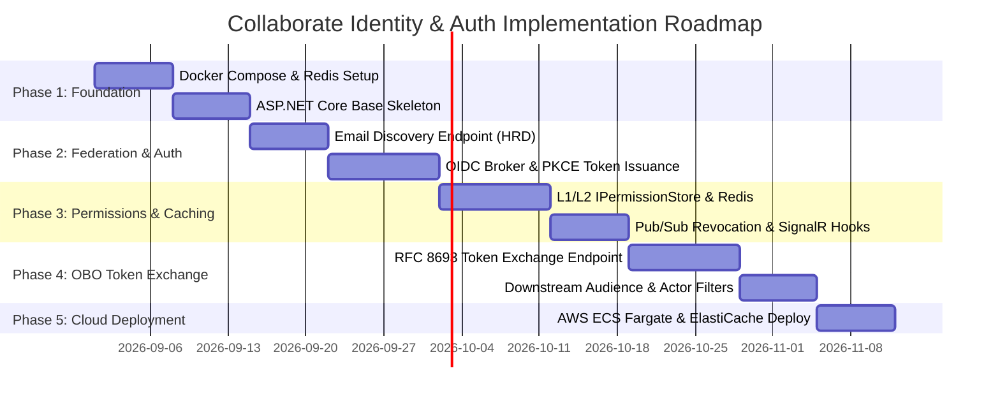
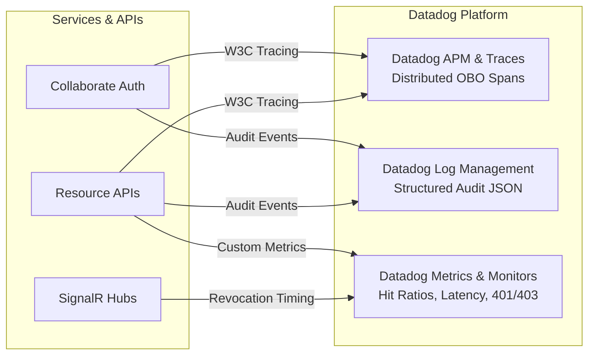
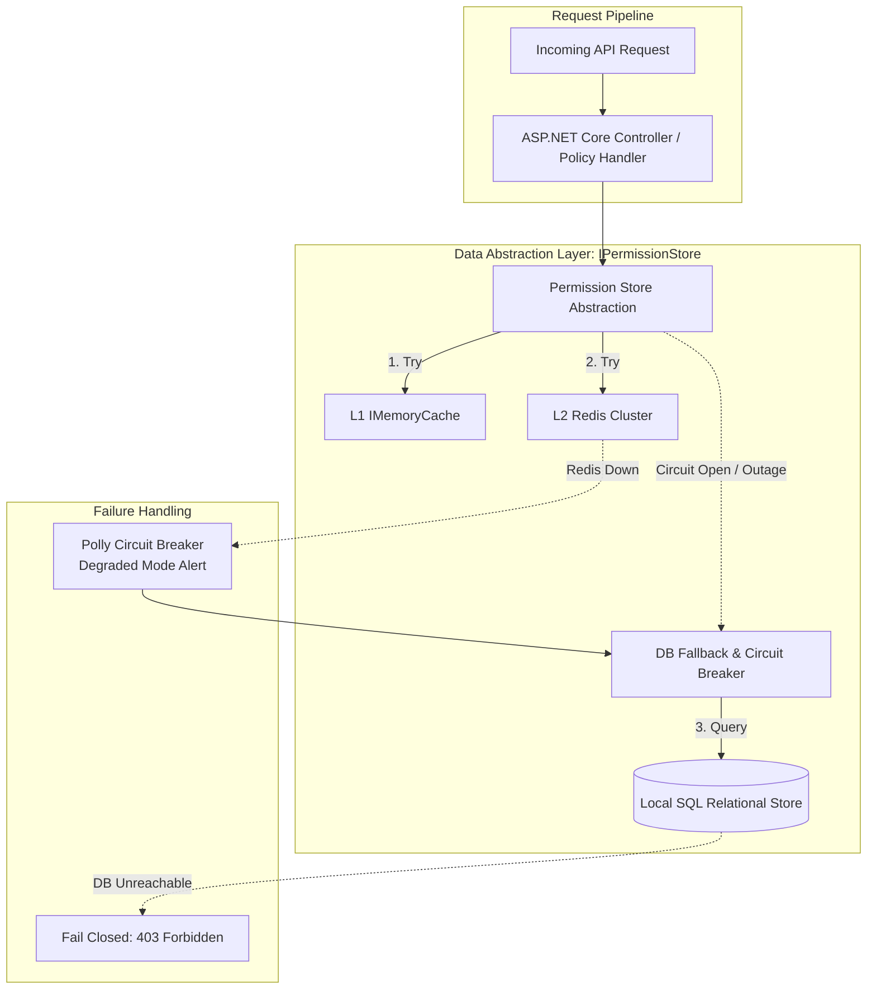

# Collaborate Identity & Authorization — Architecture & Design Specification

**System:** Caseware Collaborate Identity & Authorization Platform  
**Target Platform:** C# / .NET 8, ASP.NET Core, AWS (ECS / Fargate), Redis Cluster, Relational DB  

---

## Executive Summary & Core Design Approach

Collaborate requires a standards-compliant (OAuth2 / OIDC), high-throughput identity and authorization layer supporting multi-tenant firm federation, fine-grained workspace permissions, sub-second revocation, and secure on-behalf-of delegation.

The architecture balances three core requirements:
1. **Strict Security & Standards Compliance:** Standard Authorization Code + PKCE for login, multi-tenant federation (Caseware Central IdP + external SAML/OIDC IdPs), and RFC 8693 Token Exchange for delegation to prevent the Confused Deputy problem.
2. **High-Throughput Authorization (10k+ checks/sec):** Microservices (Documents, Comments, Financial Data) cannot query the SQL database on every request. A multi-tier caching abstraction (`IPermissionStore`: L1 In-Memory $\rightarrow$ L2 Redis $\rightarrow$ SQL DB) serves evaluations in sub-millisecond time.
3. **Sub-Second Revocation (<1s):** Revocations and membership removals trigger event hooks in the database that publish to Redis Pub/Sub, immediately evicting L1 cache entries across API nodes and dropping active WebSocket / SignalR collaborative editing sessions.

---

## 1. High-Level Architecture

The system topology decouples the frontend, the Collaborate Auth broker, downstream microservices, the caching tier, and upstream identity providers:



### 1.1 Authentication & Federation Flow (Login)

Collaborate Auth acts as a **Federation Broker** (OIDC Relying Party to upstream IdPs, and OAuth 2.0 Authorization Server to Collaborate applications):

1. **Email-First Home Realm Discovery (HRD):**
   - The user inputs their email address on the login screen.
   - The frontend calls `GET /api/v1/auth/discovery?email=user@domain.com`.
   - If the domain matches internal staff (`@caseware.com`), the user is routed to the **Caseware Central IdP**.
   - If the domain matches a firm with enterprise SSO configured, they are redirected to that firm's **SAML 2.0 / OIDC IdP**.
   - Otherwise, invited external users authenticate with standard Collaborate invite/local credentials.

2. **Authorization Code Flow + PKCE:**
   - The frontend initiates standard **Auth Code + PKCE** (`code_challenge` / `code_challenge_method=S256`) against Collaborate's `/authorize` endpoint.
   - Collaborate preserves client state and PKCE parameters, redirecting the browser to the selected upstream IdP.

3. **Assertion Processing & Token Issuance:**
   - The upstream IdP authenticates the user and redirects back to Collaborate (`/auth/callback/...`).
   - Collaborate validates the assertion/signature, maps external claims to internal user IDs and firm memberships, and completes the PKCE exchange.
   - Collaborate signs and issues an **RS256 JWT Access Token** containing:
     - `sub`: Internal Collaborate user ID.
     - `tenant_id` / `firm_id`: Active firm context.
     - `user_type`: `firm_staff` vs. `external_client`.
     - `jti` / `sid`: Unique token and session identifiers for rapid revocation tracking.

---

### 1.2 Fine-Grained Permission Checking & Multi-Tier Caching

Downstream services evaluate authorization rules for every request:
$$\text{Access Granted} \iff \text{Firm Policy evaluates TRUE} \land (\text{Workspace Role} \lor \text{Resource ACL Override})$$

To support 10,000+ checks/second without overloading the database, permission evaluations go through a Data Abstraction Layer (`IPermissionStore`):



- **L1 In-Memory Cache (Per-Instance):** ASP.NET Core `IMemoryCache` with a 30–60s sliding TTL. Serves hot-path requests in-memory with zero network overhead.
- **L2 Distributed Cache (Redis Cluster):** Shared across service replicas (TTL 10–15 minutes) with structured cache keys:
  - Workspace role: `firm:{firm_id}:ws:{workspace_id}:user:{user_id}:role`
  - Resource override: `firm:{firm_id}:res:{resource_id}:user:{user_id}:acl`
- **Database (Relational DB):** Source of truth, queried only on cache misses.

---

### 1.3 Real-Time Revocation & Active Session Termination (<1s)

When an external user is removed from a workspace, permissions must revoke immediately across both stateless HTTP requests and active collaborative editing sessions:



- **Database Commit Hook:** Role/membership mutations trigger an invalidation publisher post-commit (via EF Core Interceptor or Transactional Outbox).
- **Pub/Sub Channel:** Events are broadcast to `collaborate:events:security-revocation`.
- **Stateless HTTP APIs:** Nodes evict targeted keys from local L1 memory. The next HTTP request hits Redis/DB and is denied immediately.
- **Stateful WebSocket / SignalR Hubs:** Hubs receive the revocation event, abort in-flight document operations, send a `403 Forbidden` disconnect frame, and terminate the socket connection.

---

### 1.4 On-Behalf-Of (OBO) Delegation & Confused Deputy Prevention

When an internal service (Comments) calls a downstream API (Notifications) on behalf of a user, or when an external firm system calls Collaborate on behalf of an employee, the architecture utilizes **OAuth 2.0 Token Exchange (RFC 8693)** to eliminate the Confused Deputy problem.



#### Token Structure & Claim Separation:
- **`sub` (Subject):** The human user on whose behalf the operation is executed (preserves auditability).
- **`act` (Actor):** Identifies the calling service/system (`act: { "sub": "service_collaborate_comments" }`).
- **`aud` (Audience):** Strictly limited to the target downstream resource (`https://api.caseware.com/notifications`).
- **`scp` / `scope`:** Narrowed to the minimum required permissions (`notifications:write`).

#### Downstream Enforcement:
1. **Audience Validation (`ValidateAudience = true`):** ASP.NET Core strictly rejects tokens whose `aud` does not match the target service.
2. **Effective Scope Intersection:**
   $$\text{Effective Scope} = \text{User Permissions} \cap \text{Caller Entitlements} \cap \text{Requested Scope}$$
3. **Audit Trail Logging:** All services log both `sub` and `act.sub` for security investigations and regulatory compliance.

---

## 2. Implementation Plan

The rollout strategy is structured around local-to-cloud parity and clear phase boundaries:



### 2.1 Local & Cloud Setup
- **Production Target (Docker & Cloud Containers):** In a production enterprise deployment, the architecture utilizes multi-container Docker images (ASP.NET Core API, Redis Alpine, and relational database) deploying to **AWS ECS Fargate** behind an Application Load Balancer, with distributed caching on **AWS ElastiCache for Redis** (Multi-AZ).
- **12-Factor Environment Configuration:** Container images run identically across Dev, Staging, and Production, configured dynamically via environment variables (`REDIS__CONNECTION_STRING`, `AUTH__ISSUER_URL`, etc.).
- **Take-Home Exercise Scope:** For the purpose of this challenge submission, physical Dockerfiles and container compose manifests have been intentionally omitted in favor of direct `.NET 8 SDK` execution (`dotnet run`, `dotnet test`) and fast, in-memory data store implementations to ensure immediate, zero-dependency local evaluation.

### 2.2 Rollout Phases
1. **Phase 1 (Foundation):** ASP.NET Core solution skeleton, container definitions, and configuration binding.
2. **Phase 2 (Login/Federation):** Discovery endpoint (`/api/v1/auth/discovery`), upstream OIDC/SAML broker, PKCE exchange, RS256 token issuance.
3. **Phase 3 (AuthZ & Revocation):** Data Abstraction Layer (`IPermissionStore`), L1/L2 caching, Redis Pub/Sub invalidation, SignalR session termination.
4. **Phase 4 (Delegation):** RFC 8693 token exchange endpoint, scope-narrowing validation, actor claim auditing.
5. **Phase 5 (Cloud Deployment):** Container image build, ECS task definition, Terraform provisioning.

---

## 3. Testing Strategy

The test strategy follows a pragmatic pyramid balancing fast unit feedback and realistic integration checks:

```
       / \
      / E2E \       - Full login, token exchange, collaborative editing flows
     /-------\
    /  Integ  \     - WebApplicationFactory + Real Redis (Testcontainers)
   /-----------\
  /    Unit     \   - Handlers, claims parsing, scope math, token exchange
 /---------------\
```

### 3.1 Unit Testing
- Test custom ASP.NET Core `IAuthorizationHandler` rules with mocked `ClaimsPrincipal` contexts.
- Test RFC 8693 request parameter parsing and scope intersection math ($\text{Effective Scope} = C \cap A \cap \text{Scope}$).

### 3.2 Integration Testing (`WebApplicationFactory`)
- Spin up real Redis instances via **Testcontainers for .NET** during automated test runs.
- Test full HTTP pipelines, middleware authentication, policy enforcement, and JSON serialization.

### 3.3 Security & Confused Deputy Tests (Scenario C)
- **Audience Mismatch Replay:** Verify that sending a token minted for Notifications to the Financial Data API is rejected (`401`/`403`).
- **Scope Escalation:** Verify that requesting broader scopes than the subject token holds returns `400 Bad Request (invalid_scope)`.
- **Audit Verification:** Verify downstream controller logs capture both `sub` and `act.sub`.

### 3.4 Revocation & Load Testing
- **Sub-Second Revocation:** Populate cache $\rightarrow$ trigger revocation via Redis $\rightarrow$ fire concurrent HTTP requests $\rightarrow$ assert `403 Forbidden` within $<100\text{ms}$.
- **WebSocket Disconnect:** Verify SignalR hub drops active editing sessions within 1 second of user removal.
- **Load Testing (k6 / NBomber):** Assert 10,000+ checks/sec with $p99 < 5\text{ms}$ on L1 and $p99 < 15\text{ms}$ on L2.

---

## 4. Evaluation & Observability

Observability in production is built on structured APM tracing, metrics, and audit logs:



### 4.1 Key Performance Targets (SLOs)
- **Throughput:** $\ge 10,000$ authorization evaluations/sec across multi-tenant firms.
- **Latency:**
  - L1 In-Memory: $< 1\text{ms}$ ($p99$).
  - L2 Redis: $< 5\text{ms}$ ($p99$).
  - DB Fallback: $< 50\text{ms}$ ($p99$).
- **Revocation Propagation:** $< 1.0\text{s}$ globally.
- **Cache Hit Ratio:** $\ge 98\%$ combined L1/L2.

### 4.2 APM Traces & Audit Logs
- **Distributed APM Traces:** Inject W3C `traceparent` headers across microservice calls, tagging spans with `subject.user_id`, `actor.service`, and `token.audience`.
- **Structured JSON Audit Logs:**
  ```json
  {
    "timestamp": "2026-08-24T21:35:00Z",
    "dd.trace_id": "648392018392",
    "event_type": "AUTHZ_EVALUATION",
    "firm_id": "firm_123",
    "workspace_id": "ws_abc",
    "sub": "usr_98765",
    "act_sub": "service_collaborate_comments",
    "resource_id": "doc_456",
    "action": "documents:read",
    "decision": "ALLOW",
    "cache_tier": "L1_HIT"
  }
  ```
- **Monitors & Alerts:** Alert if L1/L2 hit ratio falls below $95\%$, if revocation propagation takes $>2\text{s}$, or if there is an anomalous spike in $401/403$ status codes.

---

## 5. Failure Modes & Tradeoffs

Resilience in a multi-tenant authorization system requires clear degradation paths and defensive defaults:



### 5.1 Data Abstraction Layer (`IPermissionStore`) & Redis Outage Plan
- Controllers and policy handlers **never talk directly to Redis or raw SQL**. All queries flow through the `IPermissionStore` interface.
- If Redis fails or experiences a network partition, the abstraction layer catches the error via a **Polly circuit breaker**, emits an alert (`collaborate.redis.status = DEGRADED`), and **automatically falls back to querying the SQL database**.
- **Fail-Closed Security:** If both Redis and the SQL database are unreachable, the system fails closed (returns `403 Forbidden` / `503 Service Unavailable`). It will never grant unauthorized access due to infrastructure outages.

### 5.2 Network Blips & Dropped Invalidation Messages
- If an API node misses a Redis Pub/Sub revocation message due to a transient network blip, the short L1 TTL (30–60s sliding) acts as a strict upper bound. The maximum window of stale permission state is under 60 seconds.
- Reconnecting SignalR clients must re-authenticate and re-validate active workspace memberships before rejoining channels.

### 5.3 Architectural Tradeoffs

| Decision | Why Chosen | Tradeoff & Mitigation |
| :--- | :--- | :--- |
| **Data Abstraction Layer (`IPermissionStore`)** | Decouples business logic from storage; enables automatic fallback from Redis to SQL DB during outages. | Slight interface indirection (negligible runtime overhead in .NET). |
| **Multi-Tier Caching (L1 RAM + L2 Redis)** | 10k+ checks/sec with $p99 < 1\text{ms}$; protects the SQL database from heavy traffic. | Requires cache invalidation orchestration via Redis Pub/Sub on DB updates. |
| **Token Exchange (RFC 8693) for Delegation** | Solves the Confused Deputy problem; enforces strict audience isolation and audit attribution. | One internal HTTP hop to exchange tokens (mitigated by caching exchanged tokens within their TTL). |
| **Hybrid JWT (Coarse Claims + Dynamic ACLs)** | Tokens remain compact and reusable; avoids massive JWT bloat from embedding workspace permission arrays. | Downstream APIs check dynamic permissions via `IPermissionStore` rather than relying solely on static token claims. |
| **Pragmatic Service Layer vs. Full CQRS Framework** | Direct service abstractions (`IPermissionStore`, `ITokenExchangeService`) keep the codebase clean, lean, and testable within the 2–3 hour scope. | In a full enterprise production system, separating write commands (Transactional Outbox) from read queries naturally evolves into CQRS, but adopting heavy CQRS framework libraries here would add unnecessary plumbing. |
